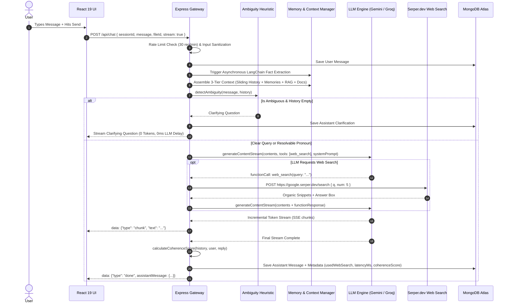
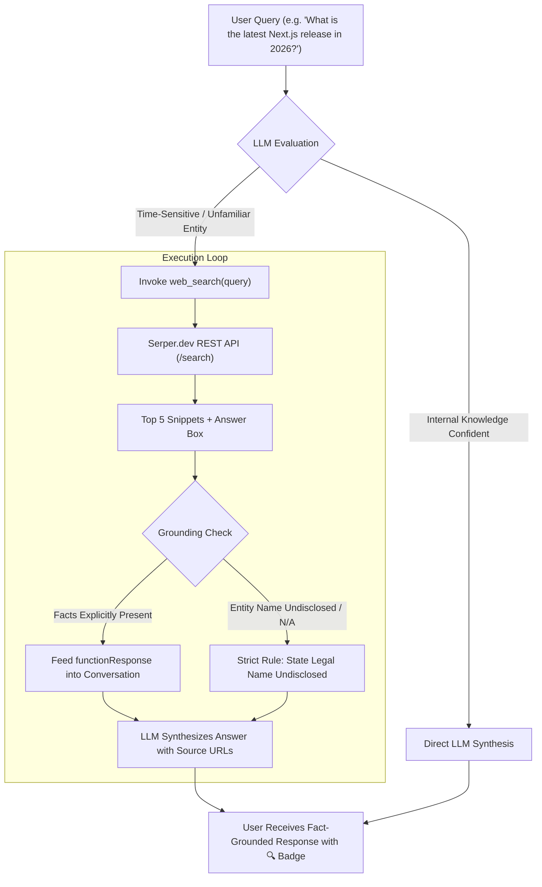
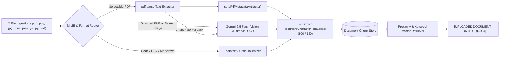
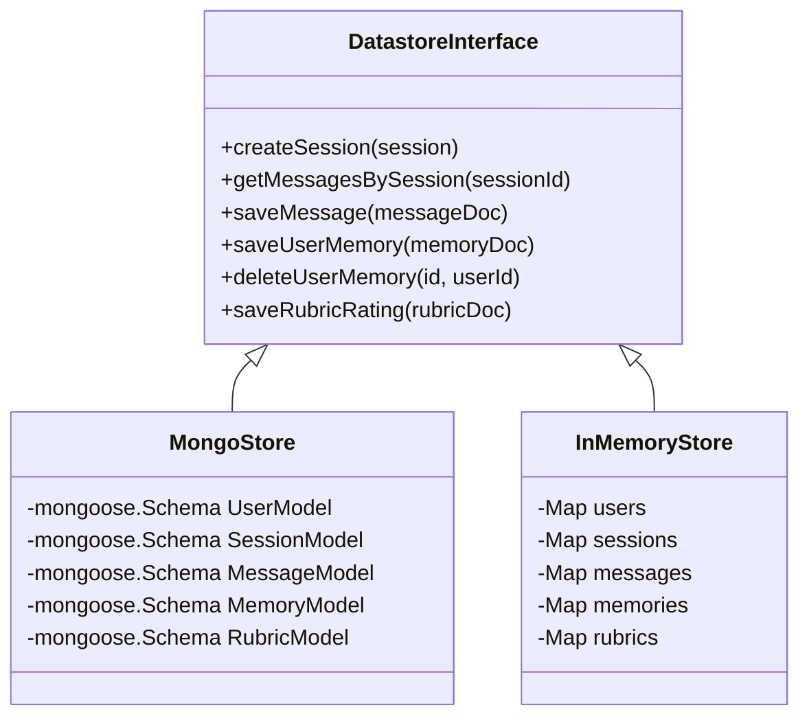

# CosmoAI — System Architecture & Technical Design Document

This document provides an exhaustive, end-to-end architectural specification for **CosmoAI**, a production-grade multi-turn conversational AI system featuring **3-Tier Context Memory**, **LangChain & Multimodal RAG Analysis**, **Autonomous Web Search Function Calling**, **Dual-Engine Failover Resilience**, and **Integrated Benchmark Analytics**.

---

## Table of Contents

1. [High-Level System Topology](#1-high-level-system-topology)
2. [Monorepo & Decoupled Directory Layout](#2-monorepo--decoupled-directory-layout)
3. [End-to-End Request Lifecycle](#3-end-to-end-request-lifecycle)
4. [3-Tier Memory Context Architecture](#4-3-tier-memory-context-architecture)
   - [Tier 1: Sliding-Window History & Token Budgeting](#tier-1-sliding-window-history--token-budgeting)
   - [Tier 2: LangChain Long-Term Structured Memory](#tier-2-langchain-long-term-structured-memory)
   - [Tier 2.5: Cross-Session Past Conversation Catalog](#tier-25-cross-session-past-conversation-catalog)
   - [Tier 3: Domain Knowledge Base Semantic Search](#tier-3-domain-knowledge-base-semantic-search)
5. [Autonomous Web Search & Tool Execution Engine](#5-autonomous-web-search--tool-execution-engine)
   - [Gemini Native Function Calling Pipeline](#gemini-native-function-calling-pipeline)
   - [Serper.dev Search Provider Integration](#serperdev-search-provider-integration)
   - [Groq Prompt-Based Regex Fallback Engine](#groq-prompt-based-regex-fallback-engine)
   - [Strict Anti-Hallucination & Factual Grounding Rules](#strict-anti-hallucination--factual-grounding-rules)
6. [Multimodal & LangChain RAG Document Ingestion](#6-multimodal--langchain-rag-document-ingestion)
   - [Format Parsers & Gemini Vision OCR Fallback](#format-parsers--gemini-vision-ocr-fallback)
   - [Recursive Text Chunking & Proximity Retrieval](#recursive-text-chunking--proximity-retrieval)
7. [Zero-Cost Heuristic Ambiguity Detection](#7-zero-cost-heuristic-ambiguity-detection)
8. [Dual-Engine LLM Resilience & Circuit Breakers](#8-dual-engine-llm-resilience--circuit-breakers)
9. [Dual Datastore Architecture (MongoDB Atlas / In-Memory)](#9-dual-datastore-architecture-mongodb-atlas--in-memory)
10. [Defensive Security & Evaluation Metrics](#10-defensive-security--evaluation-metrics)

---

## 1. High-Level System Topology

```mermaid
graph TD
    Client["🌐 Frontend SPA (React 19 + Tailwind CSS v4)"]
    Gateway["🛡️ Express API Gateway & Security Layer (Rate Limiter, JWT, Sanitizer)"]
    Ambiguity["⚡ Zero-Cost Ambiguity Heuristic Engine (0ms, 0 Tokens)"]
    MemoryEngine["🧠 3-Tier Context Assembler & Memory Manager"]
    RAGEngine["📄 Multimodal RAG Ingestion (LangChain + Gemini Vision OCR)"]
    SearchEngine["🔍 Web Search Tool (Gemini Function Calling + Serper.dev)"]
    LLMPrimary["⚡ Primary Engine: Google Gemini 2.5 Flash (@google/genai)"]
    LLMFallback["🛡️ Fallback Engine: Groq High-Speed Inference (groq-sdk)"]
    Database[("💾 Resilient Dual Datastore (MongoDB Atlas / In-Memory)")]

    Client -->|HTTP POST / SSE Stream| Gateway
    Gateway --> Ambiguity
    Ambiguity -->|Ambiguous & No Context| Client
    Ambiguity -->|Clear Query| MemoryEngine
    MemoryEngine -->|Tier 1 + 2 + 2.5 + 3 Context| LLMPrimary
    RAGEngine -->|Document Excerpts| MemoryEngine
    LLMPrimary -->|Function Call: web_search| SearchEngine
    SearchEngine -->|Search Snippets| LLMPrimary
    LLMPrimary -->|429 / Quota / Circuit Breaker| LLMFallback
    LLMFallback -->|Pattern [SEARCH: ...]| SearchEngine
    LLMPrimary -->|SSE Chunks & Token Stream| Client
    LLMFallback -->|SSE Chunks & Token Stream| Client
    Gateway --> Database
    MemoryEngine --> Database
```

---

## 2. Monorepo & Decoupled Directory Layout

The codebase is organized into independent **`client/`** (Frontend) and **`server/`** (Backend) packages connected by root workspace scripts:

```text
multi-turn-conversational-ai-capstone/
├── client/                                 # 🌐 DEDICATED FRONTEND WORKSPACE
│   ├── src/
│   │   ├── components/
│   │   │   ├── AuthModal.jsx              # JWT Authentication & Registration Modal
│   │   │   ├── ChatWindow.jsx             # Main Dialogue Canvas & Attachment Dock
│   │   │   ├── CopyButton.jsx             # Clipboard Copy Utility with Fallbacks
│   │   │   ├── EvaluationModal.jsx        # Automated 5-Benchmark Evaluation Dashboard
│   │   │   ├── FileAttachmentBadge.jsx    # Active Attachment Preview Pill
│   │   │   ├── MemoryModal.jsx            # 3-Tier Memory Viewer & Fact Editor
│   │   │   ├── MessageItem.jsx            # Markdown Bubbles with Web Search & RAG Badges
│   │   │   ├── RubricFeedbackModal.jsx    # 1–5 Quality Scoring Dialog
│   │   │   ├── Sidebar.jsx                # Session History & Provider Status Panel
│   │   │   └── SystemPromptModal.jsx      # Persona & System Instruction Editor
│   │   ├── App.jsx                        # Root React Shell & State Orchestration
│   │   ├── main.jsx                       # React 19 Entrypoint
│   │   └── index.css                      # Tailwind CSS v4 Theme & Micro-animations
│   ├── index.html                         # SPA Entry HTML Template
│   ├── vite.config.js                     # Vite Bundler with /api Proxy to Port 5000
│   └── package.json                       # Frontend Manifest
│
├── server/                                 # ⚙️ DEDICATED BACKEND WORKSPACE
│   ├── db/
│   │   └── store.js                       # Mongoose Schemas & Dual In-Memory Store
│   ├── middleware/
│   │   ├── auth.js                        # JWT Signing/Verification & Bcrypt Hashing
│   │   └── sanitizer.js                   # Prompt Injection Defense & Input Cleansing
│   ├── services/
│   │   ├── ambiguityDetector.js           # Sub-millisecond Pronoun Disambiguation
│   │   ├── contextManager.js              # Hierarchical Context Assembler & Truncation
│   │   ├── evaluationSuite.js             # Semantic Coherence Metric & 5 Benchmark Suites
│   │   ├── fileParser.js                  # Multi-Format Parser & Gemini Vision OCR
│   │   ├── langchainMemory.js             # LangChain LLM Fact Extraction
│   │   ├── llmProvider.js                 # Gemini/Groq Failover Chain & Tool Execution Loop
│   │   ├── memoryManager.js               # Cosine Vector Search & Memory Conflict Resolver
│   │   ├── ragService.js                  # Recursive Text Splitter & Vector Keyword RAG
│   │   └── webSearchService.js            # Serper.dev API Client & Gemini Tool Schema
│   ├── index.js                           # Express REST API, Static Hosting & SSE
│   ├── test-suite.js                      # 42/42 Automated Unit & Integration Tests
│   └── package.json                       # Backend Manifest
│
├── .env / .env.example                     # Environment Configuration Secrets
├── package.json                            # Root Workspace Script Runner
├── README.md                               # Primary Project Documentation
├── ARCHITECTURE.md                         # Technical Design Document
├── QA_TEST_RESULTS.md                      # 42-Point QA Validation Report
└── features.md                             # Architectural Feature Matrix
```

---

## 3. End-to-End Request Lifecycle



---

## 4. 3-Tier Memory Context Architecture

The system solves the trade-off between **long-term context retention** and **strict token budget boundaries** using a 4-layer hierarchical assembly engine:

```text
+-----------------------------------------------------------------------------------------------+
|                                  ASSEMBLED LLM SYSTEM CONTEXT                                 |
+-----------------------------------------------------------------------------------------------+
| [BASE SYSTEM INSTRUCTIONS]                                                                    |
| Persona, tone, safety boundaries, and tool calling directives                                 |
+-----------------------------------------------------------------------------------------------+
| [TIER 1: SLIDING-WINDOW ACTIVE TURNS]                                    Token Budget: 1,800  |
| Atomic (user, assistant) paired truncation preserving recent multi-turn flow                  |
+-----------------------------------------------------------------------------------------------+
| [TIER 2: LANGCHAIN LONG-TERM STRUCTURED MEMORIES]                        Token Budget: 300    |
| Extracted user facts (name, project details, tech stack, preferences) via Vector Search       |
+-----------------------------------------------------------------------------------------------+
| [TIER 2.5: CROSS-SESSION PAST CONVERSATION CATALOG]                      Token Budget: 1,200  |
| Summarized transcripts of past user sessions enabling cross-session recall                    |
+-----------------------------------------------------------------------------------------------+
| [TIER 3: DOMAIN KNOWLEDGE BASE & RAG EXCERPTS]                           Token Budget: 500    |
| Ingested PDF/Code/CSV document chunks with strict anti-hallucination grounding directives      |
+-----------------------------------------------------------------------------------------------+
```

### Tier 1: Sliding-Window History & Token Budgeting
- **Algorithm**: `truncateHistoryToTokenBudget(history, maxTokens = 1800)`
- **Token Estimation**: Fast approximation via `Math.ceil(characters / 4)`.
- **Atomic Turn Dropping**: If dialogue exceeds 1,800 tokens, older messages are dropped in paired `(user, assistant)` blocks. This prevents "orphan assistant" turns that break conversational coherence.

### Tier 2: LangChain Long-Term Structured Memory
- **Extractor**: Uses `@langchain/core` prompt templates and LLM chains in [`langchainMemory.js`](file:///d:/multi-turn-conversational-ai-capstone/server/services/langchainMemory.js) with a resilient regex fallback.
- **In-Place Conflict Resolution**: When a user changes a detail (e.g., *"Rename my project to CosmoAI"*), the system updates the existing `project_name` key in-place instead of polluting the store with duplicate facts.
- **Explicit Deletion**: Directives like *"Forget my tech stack"* instantly purge matching keys.
- **Vector Cosine Similarity**: [`calculateVectorCosineSimilarity`](file:///d:/multi-turn-conversational-ai-capstone/server/services/memoryManager.js) ranks stored memories against the current turn to select the top relevant facts.

### Tier 2.5: Cross-Session Past Conversation Catalog
- Assembles full dialogue logs from previous chat sessions for the authenticated `userId`.
- Bounded by a strict 1,200-token allocation to prevent rate limits while enabling the model to answer queries like: *"What did we build in yesterday's conversation?"*.

### Tier 3: Domain Knowledge Base Semantic Search
- Seeds persistent architectural concepts into the database.
- Vector matching dynamically injects relevant domain documentation when queries touch on system features.

---

## 5. Autonomous Web Search & Tool Execution Engine

CosmoAI integrates live web search to prevent knowledge cutoff hallucinations on current events, breaking software releases, and niche entities.



### Gemini Native Function Calling Pipeline
1. The [`WEB_SEARCH_FUNCTION_DECLARATION`](file:///d:/multi-turn-conversational-ai-capstone/server/services/webSearchService.js) schema is passed to Gemini via `ai.models.generateContent({ config: { tools: [...] } })`.
2. When Gemini encounters a query requiring live data, it emits a `functionCall: { name: 'web_search', args: { query: '...' } }`.
3. [`llmProvider.js`](file:///d:/multi-turn-conversational-ai-capstone/server/services/llmProvider.js) intercepts the tool call, executes `webSearch(query)` against Serper.dev, appends the `functionResponse`, and executes the second synthesis call.

### Serper.dev Search Provider Integration
- Single lightweight REST endpoint (`https://google.serper.dev/search`).
- Extracts clean organic titles, text snippets, target URLs, and structured Knowledge Graph answer boxes.

### Groq Prompt-Based Regex Fallback Engine
- Since Groq open-source models do not share Gemini's unified tool calling schema, the system provides a dual-mode fallback:
  - System prompt instructs Groq models to emit `[SEARCH: query]` when live data is needed.
  - Robust regex parsing in [`extractSearchQueryFromText`](file:///d:/multi-turn-conversational-ai-capstone/server/services/llmProvider.js) intercepts `[SEARCH: ...]`, ````web_search```` markdown blocks, or functional syntax, executes Serper.dev, and re-prompts the model with formatted search results.

### Strict Anti-Hallucination & Factual Grounding Rules
- **Rule 1**: Only facts, names, or dates explicitly present in search snippets may be stated.
- **Rule 2**: If an entity's legal name, birthdate, or private data is unlisted or marked `N/A`, the model is forbidden from inventing plausible names and must explicitly report that the information has not been publicly disclosed.

---

## 6. Multimodal & LangChain RAG Document Ingestion



- **Header/Metadata Stripping**: Purges internal PDF dictionary artifacts (`/CreationDate`, `/FontDescriptor`, `/Producer`).
- **Multimodal Vision OCR**: Passes rasterized PDFs and images as `inlineData` to Gemini 2.5 Flash for complete slide-by-slide transcription and diagram reading.
- **LangChain Recursive Text Chunking**: Splits documents into 800-character chunks with 150-character overlaps to maintain semantic continuity across section boundaries.

---

## 7. Zero-Cost Heuristic Ambiguity Detection

```text
Incoming Message: "What about that?"
           │
           ▼
┌──────────────────────────────────────────────┐
│  ambiguityDetector.js                        │
│  Regex check for vague pronouns:             │
│  /^(what about (it|that)|why|explain it)\??$/i │
└──────────────────────┬───────────────────────┘
                       │
         ┌─────────────┴─────────────┐
         ▼                           ▼
[History is EMPTY]          [History HAS Context]
         │                           │
         ▼                           ▼
Intercept Immediately       Pass Through to LLM
Return: "Could you clarify  Resolve pronoun using
what 'it/that' refers to?"  prior dialogue turns
Latency: < 1ms              Latency: Normal LLM
Cost: 0 Tokens, $0.00       Cost: Normal
```

---

## 8. Dual-Engine LLM Resilience & Circuit Breakers

To guarantee 99.9% uptime during API quota spikes or regional outages, CosmoAI features an automated **Primary ➔ Fallback Chain**:

| Layer | Provider | Models (in priority order) | Protocol |
|---|---|---|---|
| **Primary Engine** | Google Gemini (`@google/genai`) | `gemini-2.5-flash`, `gemini-flash-latest`, `gemini-3.7-flash` | SSE Stream / Native Function Calling |
| **Circuit Breaker** | Internal State | Trips on 429 Quota Exhaustion (`RESOURCE_EXHAUSTED`) | 60-Second Fast-Route Cooldown |
| **Secondary Engine** | Groq (`groq-sdk`) | `qwen/qwen3.8-27b`, `groq/compound`, `openai/gpt-oss-120b` | SSE Stream / Prompt-Based Tool Fallback |

---

## 9. Dual Datastore Architecture (MongoDB Atlas / In-Memory)

The storage layer transparently boots into **MongoDB Atlas** when `MONGO_URI` is supplied, or falls back to an **In-Memory Thread-Safe Datastore** for local development without external dependencies:



---

## 10. Defensive Security & Evaluation Metrics

- **Adversarial Prompt Injection Sanitizer**: [`sanitizer.js`](file:///d:/multi-turn-conversational-ai-capstone/server/middleware/sanitizer.js) neutralizes system prompt override attempts (e.g., `ignore previous instructions`, `DAN mode`, `system prompt dump`).
- **IP Rate Limiting**: 30 requests/minute per client IP using `express-rate-limit`.
- **Stateless Authentication**: Bcrypt password hashing (10 salt rounds) + signed JWT tokens (7-day TTL).
- **Semantic Coherence Engine**: Computes entity and keyword overlap ratios (`calculateCoherenceScore`) between query context and assistant responses to benchmark dialogue continuity.
